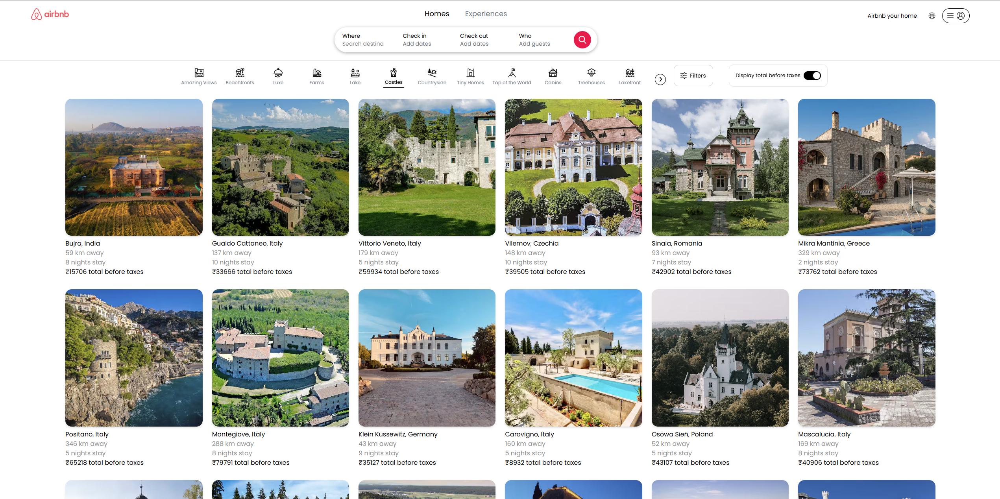
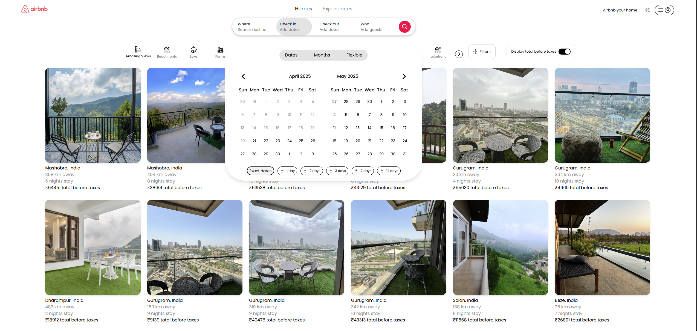
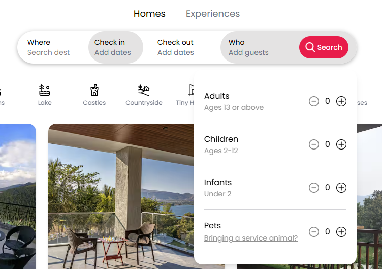
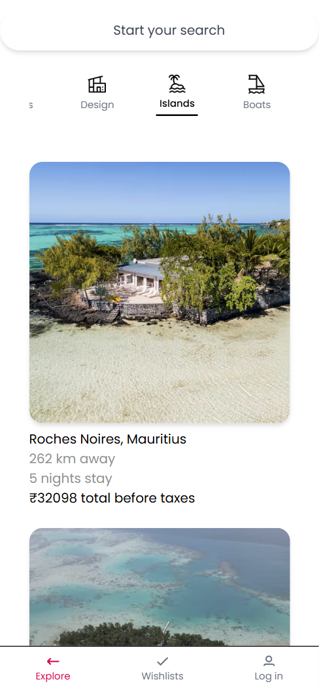
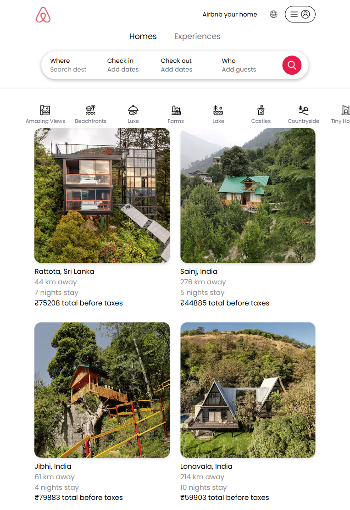

# Airbnb Frontend Clone 🏡

A fully responsive and animated frontend clone of Airbnb, built using **React**, **Tailwind CSS**, and **Recoil**. This project mimics the look and behavior of Airbnb's modern web UI with category filtering, skeleton loading, and mobile navigation.

---

## 🚀 Features

- 📂 All categories are functional and update the UI accordingly 
- 🔍 Scrollable category bar with icons on small screen
- 📅 Calendar date picker for check-in/out
- 🧒 Guest selector with adults, children, pets, etc.
- 🏠 Responsive grid layout for stays
- ⏳ Skeleton loading with shimmer animation
- 🌐 Responsive search and filters

---

## 🛠 Tech Stack

- **React**
- **Tailwind CSS**
- **Recoil** for state management
- **Framer Motion** for animations
- **Vercel** for deployment

---

## 📸 Screenshots

### 💻 Desktop View





### 📱 Mobile View



### 📱 Tablet View




## 🧑‍💻 Getting Started

```bash
git clone https://github.com/TakshilCodes/Airbnb-Frontend-Clone.git
cd Airbnb-Frontend-Clone
npm install
npm run dev
```

Then open: `http://localhost:5173`

---

## 🌐 Live Demo

👉 [View Live Site](https://takshil-airbnb-clone.vercel.app/)  

---

## 🙌 Credits

- Inspired by Airbnb.com
- All UI/UX recreated for learning purposes only

---

## 📄 License

This project is for educational purposes only and not affiliated with Airbnb.

---

Made with ❤️ by [@TakshilCodes](https://github.com/TakshilCodes)